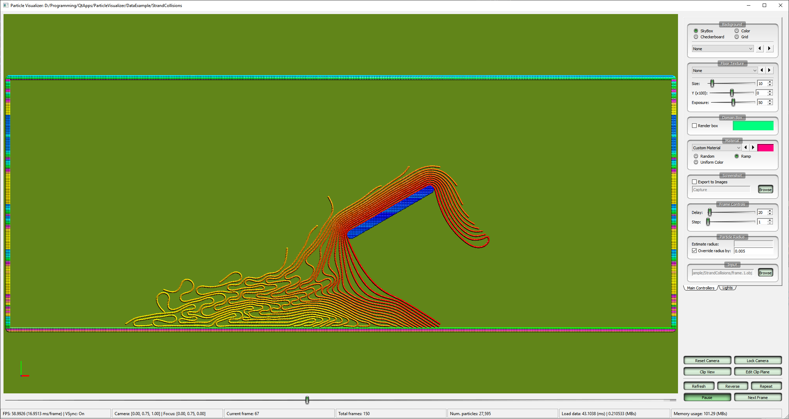

# ParticleVisualizer

This is a generalized version from my personal tool for visualizing data of particle-based simulations.
It supports data with either 2D or 3D coordinates, written in Partio (`*.bgeo`), Wavefront (`*.obj`), or binary (`*.bin` or `*.pos`) file formats.
Binary and sample data have been provided for instance use (see the Download section below).


<p align="center">
<table style="border-collapse: collapse; border: none; width: 80%; margin-left:10%; margin-right:10%">
<tr>
<td></td>
<td></td>
</tr>
<tr>
<td></td>
<td></td>
</tr>
<tr>
<td></td>
<td></td>
</tr>
</table>
</p>


### Download

* Binary and sample data: https://github.com/ttnghia/ParticleVisualizer/releases


### Input Data

Particle data need to be written as a file sequence in one of the forms
* `<file_name>.%d.<extension>`, or
* `<file_name>.%3d.<extension>`, or
* `<file_name>.%4d.<extension>`

For example: `frame.0001.bgeo`, `frame.0002.bgeo` etc.

There are 3 file formats supported: Partio (`*.bgeo`), Wavefront (`*.obj`), or binary (`*.bin` or `*.pos`).
The binary format must begin with the following layout:
```
Bytes 0-3(unsigned int): number of particles
Bytes 4-7(float): particle radius
Next (4 x Dimension x numParticles) bytes: array of particle positions

<other_additional_data>
```
where `Dimension` can be `2` or `3`. If it is `2`, it must be specified in a `.json` (scene description) file. Default value is `3`.

Depending on simulation, some additional scene descriptions need to be provided in a `.json` file (arbitrary name) stored in the same folder containing the file sequence. When loading a file sequence, this description file (if exists) is also loaded automatically.
The desciption file can be used to specified camera, light, material etc. Below is an example of a description file with all parameters:
```json
{
    "VisualizationParameters": {
        "Dimension": 2,
        "DomainBox": {
            "BoxMin": [-0.3, 0, -0.5],
            "BoxMax": [0.7, 1, 1.5]
        },
        "RenderDomainBox": true,
        "CameraPosition": [1.15, 0.5, 0.7],
        "CameraFocus": [0, 0.25, 0.7],
        "CapturePath": "Capture",
        "FrameDelay": 20,
        "OverrideParticleRadius": 0.002,
        "ColorAndMaterial": {
            "ColorMode": "Uniform",
            "Material": {
                "Ambient": [0.329412, 0.223529, 0.027451],
                "Diffuse": [0.780392, 0.568627, 0.113725],
                "Specular": [0.992157, 0.941176, 0.807843],
                "Shininess": 30
            }
        },
        "Lights": [{
                "Position": [-10, 10, -10],
                "Diffuse": [1, 1, 1]
            },
            {
                "Position": [10, 10, 10],
                "Diffuse": [1, 1, 1]
            },
            {
                "Position": [0, -10, 0],
                "Diffuse": [0.7, 0.7, 0.7]
            }
        ]
    }
}
```

* `CapturePath`: Folder to store the capture of OpenGL window when the checkbox `Export to Images` is checked.
* `FrameDelay`: The delay time (ms) before loading next frame. This parameter is specified to slow down the animation playback.
* `OverrideParticleRadius`: Specified particle radius for visualization. If no overriding radius is set, the particle radius will be computed as half the average distance between the first 1000 particles.

Other parameters such as camera and material are easy to infer.


### Brief Usage


In order to visualizer a data sequence, press `B`, or click `Browse` button in the `Input` group, and select the first file (frame) of the sequence. The program will count number of files and start visualizing the entire data set.

For convenience, a list of frequently used file sequences can be stored in the file `PlayList.txt`, line by line.
Upon start up, this file list will be loaded and displayed in a separate window. Clicking on a line from the list will load the corresponding file sequence.

**Keyboard shortcuts**:
* `B`: Broswe input data
* `O`: Browse capture folder
* `Spacing`: start/stop playback.
* `R`: Reverse placback
* `N`: Play next frame while pausing
* `[`: Play previous frame while pausing
* `]`: Play next frame while pausing
* `F1` = `Home`: Play first frame
* `End`: Play last frame
* `S`: Increase delay time between frame playback
* `F`: Decrease delay time between frame playback
* `F5`: Reload scene
* `C`: reset camera
* `X`: Clip view
* `Esc`: Exit
* `Left/Right/Up/Down arrow keys`: move camera by the corresponding directions.

---
Happy coding!